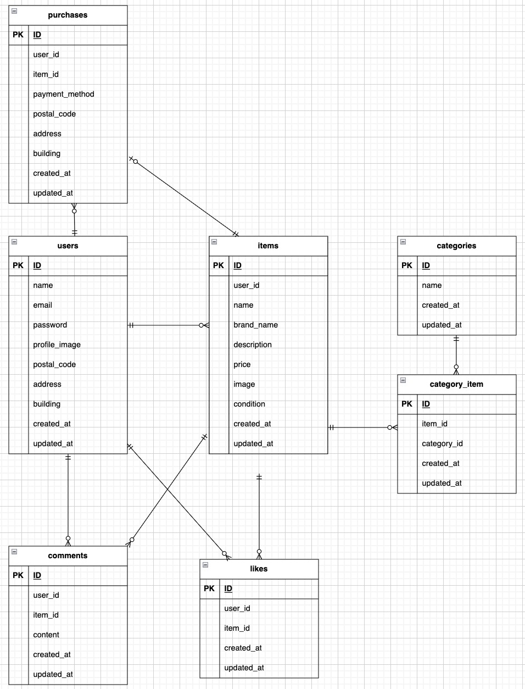

# coachtech-flea-market

## 環境構築

### Dockerビルド

```bash
git clone git@github.com:kouki014129/coachtech-flea-market.git
cd coachtech-flea-market
docker compose up -d --build
```
> *MacのM1・M2チップのPCの場合、`no matching manifest for linux/arm64/v8 in the manifest list entries`のメッセージが表示されビルドができないことがあります。
エラーが発生する場合は、docker-compose.ymlファイルの「mysql」内に「platform」の項目を追加で記載してください*
``` bash
mysql:
    platform: linux/x86_64
    image: mysql:8.0.26
    environment:
```

### Laravel環境構築
1. `docker compose exec php bash`
2. `composer install`
3. `cp .env.example .env`
4. .env のDB設定を以下のように変更してください。
``` text
APP_URL=http://localhost:82

DB_CONNECTION=mysql
DB_HOST=mysql
DB_PORT=3306
DB_DATABASE=laravel_db
DB_USERNAME=laravel_user
DB_PASSWORD=laravel_pass
```
5. Stripeを使用する場合は、以下に各自のStripeテストキーを設定してください。
``` text
STRIPE_KEY=pk_test_xxxxxxxxxxxxxxxxxxxxx
STRIPE_SECRET=sk_test_xxxxxxxxxxxxxxxxxxxxx
```

6. アプリケーションキーの作成
``` bash
php artisan key:generate
```

7. マイグレーションの実行
``` bash
php artisan migrate
```

8. シーディングの実行
``` bash
php artisan db:seed
```

9. 画像表示用のシンボリックリンクを作成します。
``` bash
php artisan storage:link
```

### テスト環境構築
PHPUnit実行時は、開発用DBとは別にテスト用DBを使用してください。

1. .env.testing を作成する
.env をコピーして .env.testing を作成し、以下のように設定してください。
``` bash
cp .env .env.testing
```
2. .env.testing のDB設定を以下のように変更してください。
```text
APP_ENV=testing
DB_CONNECTION=mysql
DB_HOST=mysql
DB_PORT=3306
DB_DATABASE=laravel_test_db
DB_USERNAME=laravel_user
DB_PASSWORD=laravel_pass
MAIL_MAILER=array
SESSION_DRIVER=array
QUEUE_CONNECTION=sync
STRIPE_KEY=pk_test_xxxxxxxxxxxxxxxxxxxxx
STRIPE_SECRET=sk_test_xxxxxxxxxxxxxxxxxxxxx

```
3. テスト用データベースを作成する
MySQLコンテナに入り、以下を実行してください。
```bash
docker compose exec mysql bash
mysql -u root -proot
```
```bash
CREATE DATABASE laravel_test_db;
GRANT ALL PRIVILEGES ON laravel_test_db.* TO 'laravel_user'@'%';
FLUSH PRIVILEGES;
EXIT;
```
4. phpunit.xml の設定を確認する
phpunit.xml が以下の内容になっていることを確認してください。
```xml
<?xml version="1.0" encoding="UTF-8"?>
<phpunit xmlns:xsi="http://www.w3.org/2001/XMLSchema-instance"
         xsi:noNamespaceSchemaLocation="./vendor/phpunit/phpunit/phpunit.xsd"
         bootstrap="vendor/autoload.php"
         colors="true"
>
    <testsuites>
        <testsuite name="Unit">
            <directory suffix="Test.php">./tests/Unit</directory>
        </testsuite>
        <testsuite name="Feature">
            <directory suffix="Test.php">./tests/Feature</directory>
        </testsuite>
    </testsuites>
    <coverage processUncoveredFiles="true">
        <include>
            <directory suffix=".php">./app</directory>
        </include>
    </coverage>
    <php>
        <server name="APP_ENV" value="testing"/>
        <server name="BCRYPT_ROUNDS" value="4"/>
        <server name="CACHE_DRIVER" value="array"/>
        <server name="DB_CONNECTION" value="mysql"/>
        <server name="DB_DATABASE" value="laravel_test_db"/>
        <server name="MAIL_MAILER" value="array"/>
        <server name="QUEUE_CONNECTION" value="sync"/>
        <server name="SESSION_DRIVER" value="array"/>
        <server name="TELESCOPE_ENABLED" value="false"/>
    </php>
</phpunit>
```
5. テスト用DBのマイグレーションを実行する
```bash
php artisan config:clear
php artisan migrate --env=testing
```
6. テストを実行する
```bash
php artisan test
```


### 開発環境

- 開発環境：http://localhost:82
- phpMyAdmin：http://localhost:8082

### 使用技術（実行環境）

- PHP 8.1
- Laravel 8.83.29
- MySQL 8.0.26
- nginx 1.21.1
- Docker / docker compose

### ER図



### シーダーについて
初期データ投入のため、以下の順でシーダーを実行しています。

1. UserSeeder
2. CategorySeeder
3. ItemSeeder
4. ItemCategorySeeder

テーブルは users テーブルへの外部キー制約を持つため、UserSeeder を先に実行する必要があります。

商品とカテゴリーは多対多の関係のため、ItemCategorySeeder で中間テーブルに商品とカテゴリーの紐付けデータを作成しています。

商品画像は `storage/app/public/items` 配下に配置し、`php artisan storage:link` により `public/storage` から参照できるようにしています。
